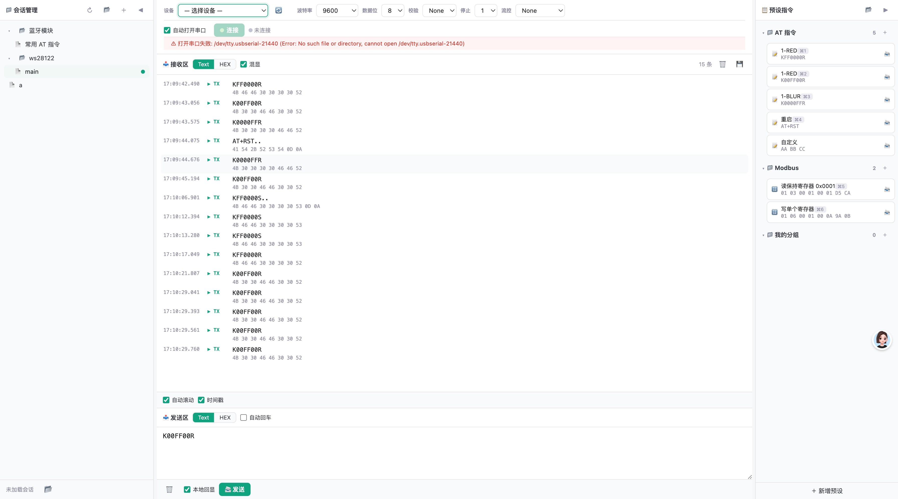

# Serialport Tool

> 串口调试助手 Web 版 - 基于 Node.js + serialport，浏览器端操作串口

  



## 🚀 快速开始

### 方式 1：作为 npm 全局命令

```bash
# 全局安装
npm install -g serialport-tool

# 运行（终端打印地址，浏览器自动打开）
serialport-tool
```

打开浏览器访问 `http://localhost:8765`，即可使用。

### 方式 2：从源码启动

```bash
# 克隆并安装依赖
git clone https://github.com/hbysgx/serialport-tool.git
cd serialport-tool
npm install

# 启动（终端打印地址，浏览器自动打开）
npm start

# 开发模式（热重载）
npm run dev
```

启动后终端显示：

```
╔══════════════════════════════════════╗
║   🔌 Serial Tool - 串口调试助手      ║
║──────────────────────────────────────║
║   地址: http://localhost:8765        ║
║   按 Ctrl+C 退出                     ║
╚══════════════════════════════════════╝
```

## ✨ 核心特性

- 🔌 **完整串口参数** - 波特率 1200~921600 / 数据位 / 校验 / 停止位 / 流控
- 📋 **预设指令** - 分组管理 + ASCII/HEX 双格式 + ⌘1~⌘9 全局快捷键
- 📁 **会话管理** - 左侧树状目录，每个会话独立保存完整配置 + 预设
- 🔄 **自动保存** - 参数变更 0.2s 后自动写回当前会话
- 📜 **实时日志** - ASCII + HEX 双视图，时间戳，可导出 .txt
- 🔄 **设备热插拔** - 自动 3s 扫描串口设备
- 🎯 **本地回显** - 区分 TX(绿) / RX(蓝)
- 🌐 **浏览器操作** - 启动后在浏览器中使用，无需安装桌面应用

## 🖥 界面布局

页面整体为 **三栏 + 顶栏 + 底栏** 结构：

```
┌────────────┬──────────────────────────────────────────────┬──────────────┐
│            │ 设备/波特率/数据位/校验/停止位/流控 [刷新]    │              │
│            ├──────────────────────────────────────────────┤  预设指令     │
│            │ ☑ 自动打开串口  [连接/未连接]                │ ┌ AT 指令   │
│   会话     │ ⚠ 错误信息条（打开失败时显示）                │ │  1-RED ⌘1  │
│   管理     ├──────────────────────────────────────────────┤ │  1-BLUR ⌘3 │
│   树状     │ 接收区  [Text][HEX][☑混显]   15条 [清空][保存]│ │  重启   ⌘4  │
│   侧栏     │ 17:09:42.490 ▶ TX  KFF0000R                  │ │  自定义      │
│            │              4B 46 46 30 30 30 52            │ ├ Modbus    │
│   蓝牙模块 │ 17:09:43.056 ▶ TX  K00FF00R                  │ │  读保持… ⌘5  │
│   常用AT  │              4B 30 30 46 46 30 30 52            │ │  写单个… ⌘6  │
│   ws28122 │ ...                                          │ ├ 我的分组    │
│   main    │ ☑ 自动滚动  ☑ 时间戳                          │ └             │
│   a       ├──────────────────────────────────────────────┤              │
│            │ 发送区  [Text][HEX][☐自动回车]                │  + 新增预设   │
│            │ ┌──────────────────────────────────────┐    │              │
│            │ │ K00FF00R                             │    │              │
│            │ └──────────────────────────────────────┘    │              │
│            │ [清空]  ☑ 本地回显  [发送]                    │              │
└────────────┴──────────────────────────────────────────────┴──────────────┘
未加载会话  [状态栏]
```

**区域说明：**

| 区域 | 位置 | 功能 |
|---|---|---|
| 顶栏 | 顶部 | 设备/参数选择 + 自动打开串口 + 连接按钮 + 错误提示 |
| 会话管理 | 左侧 | 会话/文件夹的树状目录，顶部含刷新/新建/折叠按钮 |
| 预设指令 | 右侧 | 分组管理预设指令，每条可绑定 ⌘1~⌘9 快捷键 |
| 接收区 | 中部上 | 实时显示 TX/RX 数据，支持 Text/HEX/混显，可清空与导出 |
| 发送区 | 中部下 | 编辑要发送的内容，支持 Text/HEX/自动回车，可启用本地回显 |
| 状态栏 | 底部 | 显示当前会话状态、未保存提示等 |

## ⌨️ 快捷键

| 快捷键 | 功能 |
|---|---|
| ⌘O | 连接串口 |
| ⌘D | 断开串口 |
| ⌘S | 保存会话 |
| ⌘1~⌘9 | 发送绑定快捷键的预设指令 |
| ⌘⇧P | 切换预设面板显隐 |
| ⌘⇧S | 切换会话侧栏显隐 |
| ⌘↩ | 发送输入框内容 |

## 🎯 核心使用流程

1. 启动 `serialport-tool` → 浏览器自动打开
2. 左侧点 `＋` 新建会话（如"我的ESP32"）
3. 顶栏选择串口设备 + 波特率 115200
4. 点 **连接**
5. 右侧预设面板中添加预设指令，可选绑定快捷键
6. 一切变更自动保存到会话

## 💾 持久化策略

### 配置 (`~/.serial_tool/config.json`)

所有串口参数、视图设置保存在 JSON 文件中，启动时自动恢复。

### 会话 (`~/.serial_tool/sessions/`)

```
~/.serial_tool/sessions/
├── <session-name>.json   # 会话 A (含配置快照 + 预设 + 日志)
├── <folder>/              # 自定义目录
│   └── <session>.json     # 目录中的会话
└── ...
```

每个会话 JSON 包含完整的配置快照、预设分组、日志条目。

### 预设 (`~/.serial_tool/presets.json`)

全局预设文件。会话加载时会话级预设独立存储在会话 JSON 中。

## 🔧 串口权限

如果提示无法打开设备:

```bash
# 查看设备
ls -la /dev/cu.*

# 加入 uucp 组 (macOS)
sudo dseditgroup -o edit -a $(whoami) -t user _uucp

# Linux
sudo usermod -a -G dialout $(whoami)
```

## 📁 工程结构

```
serialport-tool/
├── bin/
│   └── cli.js                    # CLI 入口 (npm bin)
├── asserts/
│   └── serialport-tool.jpg       # README 截图
├── src/
│   ├── index.ts                   # 主入口 — HTTP + WebSocket 服务器
│   ├── serial-port.ts             # 串口管理 (serialport 封装)
│   ├── app-config.ts              # 应用配置 (持久化)
│   ├── preset-store.ts            # 预设指令管理
│   ├── session-store.ts           # 会话管理 (树状文件系统)
│   └── public/
│       └── index.html             # 前端 SPA
├── package.json
├── tsconfig.json
└── README.md
```

## 🚀 npm 发布记录与排障

本项目首次发布到 npm 时遇到过以下问题，后续发版可按这个顺序检查。

### 发布前检查

```bash
# 构建
npm run build

# 查看即将发布的文件
npm pack --dry-run

# 确认当前登录账号
npm whoami

# 查看包名/版本是否已存在
npm view serialport-tool version
```

`npm pack --dry-run` 应只包含运行所需文件，例如 `dist/`、`bin/`、`README.md`、`LICENSE` 和 `package.json`。

### npm cache 权限问题

如果遇到类似错误:

```text
Your cache folder contains root-owned files
```

说明本机 `~/.npm` 里有 root 权限文件。可以临时指定一个可写 cache 目录绕过:

```bash
npm --cache /private/tmp/serial_tool_npm_cache pack --dry-run
npm --cache /private/tmp/serial_tool_npm_cache publish --access public
```

也可以按 npm 提示修复 `~/.npm` 的文件所有权。

### bin 字段路径问题

发布时 npm 曾提示:

```text
"bin[serialport-tool]" script name bin/cli.js was invalid and removed
```

原因是 `package.json` 中 `bin` 路径写成了 `./bin/cli.js`。应使用 npm 规范化后的写法:

```json
{
  "bin": {
    "serialport-tool": "bin/cli.js"
  }
}
```

如果不修复，发布后的包可能没有 `serialport-tool` 命令入口。

### 2FA 与 token 问题

如果发布时报错:

```text
Two-factor authentication or granular access token with bypass 2fa enabled is required
```

需要在 npm 后台创建 granular access token，并确认:

- `Packages and scopes` 有目标包的权限，首次发布新包可选择 all packages
- 权限为 read and write
- 勾选 bypass two-factor authentication (2FA)

推荐把 token 写入用户级 npm 配置，后续本机发布会自动使用:

```bash
npm config set //registry.npmjs.org/:_authToken <npm_token> --location=user
```

不要把 token 写入项目仓库，也不要提交 `.npmrc`。如果 token 曾经暴露在聊天、日志或截图中，应在 npm 后台撤销后重新生成。

### 首次发布命令

```bash
npm publish --access public
```

如果已经持久化 token 到 `~/.npmrc`，直接运行上面的命令即可。

## 📝 License

MIT
